# 郑州大学学士陈m全教你如何用学术不端骗到C9硕士学位

# 个人简介
大家好，我是陈m全，学士，`郑州大学`信息工程学院（现电气与信息工程学院）本科毕业生，2022年考研至某C9院校软件学院工程硕士金融科技专业。主要拟研究方向为计算机视觉、自动驾驶及其仿真测试。在3年的研究生期间，我没有撰写任何一篇学术论文、没有申请任何一项专利和软著、没有报名任何一种竞赛、没有参与任何一项科研项目、甚至没有学会任何一种仿真测试软件的使用，毕业论文从选题到提交预答辩仅花费1个月时间，但我却可以顺利通过某C9院校的学位论文答辩，心安理得地享受一纸C9研究生学历所带来的学历溢价和各种好处。

我认为，在某C9院校踏踏实实做科研，是一种非常愚蠢的行为。因此，我将要向大家介绍我的宝贵经验，即如何通过学术作假和学术不端，以极低的时间成本骗到学位。具体而言，首先我通过抄袭、洗稿两篇他人发表在NeurIPS-2023和AAAI-2024上的会议论文，我凑出了毕业论文中的两个主要创新点，并且通过半编造半抄袭的方式造出了所有的实验数据，分别对应毕业论文的第3章和第4章；其次我通过抄袭他人的综述性论文，我凑出了毕业论文的研究背景部分，对应毕业论文的第2章。

|  |
|:-------------------:|
| 陈m全肖像照    |

# 什么，你说法律？我都想笑

众所周知，《中华人民共和国学位法》已经于2025年1月1日正式生效，其中对学术不端行为的定性、处理办法进行了规定。另外，某C9院校内部在2019年同样颁布了《XXXX大学规范研究生学术行为实施办法》，进一步细化了学术作假和学术不端行为的定义以及调查程序、处罚办法。但是请你别忘了，我们身处一个“你法我笑”的国家，因此上述法律和规定的效力连厕纸都不如。更甚者，我甚至敢于在学部领导调查我的学术不端行为时，当面对其发出`死亡威胁`，扬言要`弄死他`，而他却连处罚我都不敢！

# 研究生生存宝典

众所周知，`当前日益严格的研究生毕业要求、与研究生对混学历骗学历的向往，是当前阶段我国研究生所面临的主要矛盾`。因此，我将我在C9大学的3年就读经验总结为以下研究生生存宝典，内容涵盖如何对待导师、如何对待科研、如何对待项目、如何骗取实习、如何混过答辩等诸多高质量内容。

- 通过在2022年秋季的实验室资产清查行动中故意`瞒报错报`、将完好设备报为报废，我成功逼迫我的研究生导师为我购买全新的个人主机，并顺便差点坑了实验室学术带头人，以报该教授批评我读论文不认真的一箭之仇。

- 通过在课题组安排的科研项目工作中故意`不干活`，我成功拖慢了本课题组的科研项目进度，导致甲方不满，从而实现导师和同学再也不敢让我参与任何科研项目的效果。

- 通过在导师安排的小论文合作撰写中故意`不出力`，我成功拖慢了本课题组的论文撰写进度，差点导致错过投稿日期，从而实现导师和同学再也不敢让我参与任何小论文撰写的效果。
`
- 通过编造“家里穷”人设，在我的导师面前`哭穷`，我成功利用我导师的同情心在大一暑假即骗取了外地实习的机会，成为了本学院有史以来外出实习时间最早的硕士研究生。不过，我的家庭其实一点也不穷：我爱好摄影、购买高端摄影设备；我爱好猫咪，在学生宿舍里养猫；我爱好手表，天天将价值不菲的手表戴在手上，但我的导师却丝毫没有怀疑过我的“家里穷”人设。要知道，现在的导师都是非常好骗的，谁不骗导师谁吃亏。

- 通过在实验室报销流程中故意`虚报数字`，我差点白白赚了上千块。要知道，国家的科研经费不骗白不骗，反正最后要负责的是我的导师和实验室的财务老师，不是我本人。

- 毕业论文要按学院要求写工程性论文吗？恰恰相反。虽然我本人是工程硕士，但我毅然选择`编造`一篇算法性论文作为我的毕业论文。虽然我的导师极力推荐我做一篇工程性的毕业论文，但要知道，算法性论文是很好抄的，而工程性论文的工作量是很大的，我怎么可能做这种费力不讨好的蠢事呢？

- 毕业论文需要想idea做实验吗？完全不用。通过`抄袭`一篇他人公开发表在NeurIPS-2023上的会议论文，我成功凑出了我毕业论文中的第一个“创新点”，并`编造`了所有的实验数据；通过抄袭一篇他人公开发表在AAAI-2024上的会议论文，我成功凑出了我毕业论文的第二个“创新点”，并通过`半抄袭半编造`的方式造出了所有的实验数据。

- 毕业论文需要自己总结研究现状吗？省省吧你。通过`抄袭、翻译、拼接`多篇综述性论文，我轻松写出了我的毕业论文研究现状章节。要知道，我根本读不懂专业性论文，怎么可能对研究现状自己做出总结，那样也太不现实了！

- 毕业论文的贡献点如何总结？人有多大胆，地有多大产。比如，在毕业论文中，我在多处反复写到“时间复杂度也从 O(2N) 减少到 O(N)”，作为本人提出的“创新性”算法的重要贡献点。虽然我的导师后来告诉我，算法理论中大O记号不是这么用的，O(2N)和O(N)是一会事。但是，那我问你，对基础理论的`曲解和误用`，难道就不能算是一种大胆的“创新”吗？

- 毕业论文学术不端被抓到怎么办？撒泼打滚。在软件学院举行2022级工程硕士研究生预答辩之前，我的毕业论文学术不端就被导师和学院发现，扬言要处理我。但这根本难不倒我，要知道，按闹分配是我国的一种重要分配方式，在此基础之上，我摒弃了其他硕士生常用的装抑郁、装自杀等老套的戏码，提出并使用了一种创新性的按闹分配技术：直接在学院领导调查询问时`当面发出死亡威胁`。众所周知，人都是惜命的，你敢延毕我，我弄死你。

# 毕业论文学术不端的手把手教学

## 毕业论文第3章：抄袭自一篇他人的NeurIPS-2023论文

### 1. 第3章所提出的所谓的“FFSA”算法实际上是对发表于NeurIPS-2023上的论文PGN[1]做了一些毫无意义的微小修改，并换了一种文字描述方法所“洗稿”而成。实际上，这些微小修改根本不可能达到毕业论文声称的所谓“提高对抗样本迁移能力”的效果。

具体而言，所谓的FFSA算法和PGN[2]算法实际上只有以下两处不同，如图

| 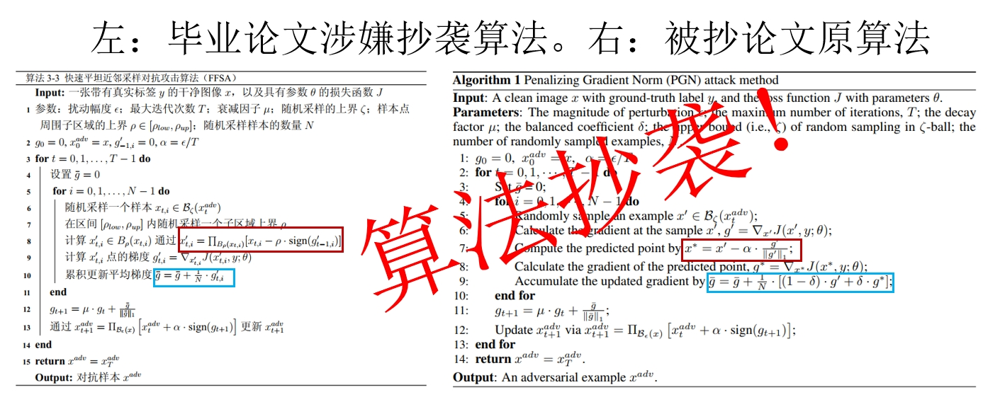 |
|:-------------------:|
| 毕业论文算法3-3与PGN[83]原作Algorithm 1的对比。不同之处仅有两处（红色和蓝色） |

第一处不同：原作[1]计算predicted point, 是利用Line 6所计算出来的新梯度g’更新得到的，并且使用L1范数对g’进行归一化；而我的毕业论文计算x’，是利用上一轮迭代（t-1轮）的梯度得到；

第二处不同：更新平均梯度时，原作[1]是用有限差分法取平均（Line 9），而我的毕业论文只只计算一次梯度信息（即第八行得到的梯度）用于更新。

[1] Ge Z, Liu H, Xiaosen W, et al. Boosting adversarial transferability by achieving flat local maxima[C]. Advances in Neural Information Processing Systems, 2023, 36: 70141-70161.

### 2. FFSA为洗稿而作的微小修改实际并不能达到毕业论文中所声称的有效性

根据本领域的经验，FFSA算法对PGN的两处微小修改毫无意义，根本不可能达到毕业论文声称的所谓“提高对抗样本迁移能力”的效果，且毕业论文中没有做任何消融实验来证明上述两个修改点能够“提高对抗样本迁移能力”。

原作[1]的Line 6对应于有限差分法的左梯度，是有理论意义的，而FFSA第8行采用上一轮的梯度对x做一步更新，不具备任何的理论意义，从理论上就不可能有提升，而且毕业论文中也没对这一问题做出任何解释；

所谓“只计算一次梯度信息”的做法早已被PGN原文[1]的消融实验结果证明无效。论文[1] Section 4.7 Figure 3 (a)对PGN算法中的超参数$\delta$进行了讨论，当$\delta$取值0或1时，PGN算法会退化为“每次随机采样只计算一次梯度信息”。可以看出，无论$\delta$取值0或1，PGN算法生成的对抗样本迁移能力都明显低于$\delta$取其他值时（$\delta$取其他值就等价于计算两次梯度）。

| 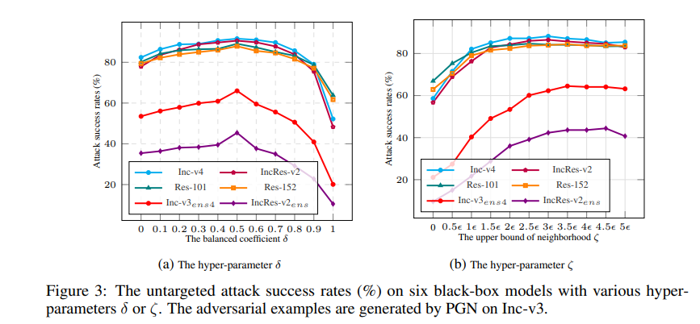 |
|:-------------------:|
| PGN消融实验结果图Section 4.7 Figure 3 (a)：只计算一次梯度信息的迁移能力（\delta取0或1）明显低于计算两次梯度信息的迁移能力（\delta取{0, 1}以外的其他值），这说明所谓的FFSA不可能有效 |

### 3. 毕业论文关于FFSA算法的描述含糊不清，甚至弄错了一些基本概念

毕业论文对所谓“FFSA”算法”进行描述时，故意混淆本领域内的一些基本概念，妄图达到将他人成果[1]混为己有的目的。

对算法复杂度理论中的“大O记号”进行混淆。在FFSA算法两个创新点的描述中，毕业论文均提到了“时间复杂度也从 O(2N) 减少到 O(N)”。但实际上“大O记号”表示法描述的是算法的渐进上界，而忽略常数因子和低阶项。因此在算法理论中，O(2N)和O(N)是没有任何区别的，不存在复杂度从O(2N)“减少到”O(N)一说，因此不能算作毕业论文的一个创新点。可见，我连计算机科学本科生必修的基本概念都不懂。

“提高了对抗样本迁移能力”的说法为编造。上述材料已经指出，所谓FFSA方法和已有的PGN算法[1]在算法层面没有任何本质的区别，怎么可能有“提高了对抗样本迁移能力”一说呢？

“对每次随机采样点周围子区域的上界进行随机调整，避免了固定上界造成的邻域信息损失”的说法为编造。PGN[1]算法的基本原理根本不是所谓的“调整采样区域的固定上界”，毕业论文的这句话纯属毫无根据的胡编乱造。

实际上，之所以PGN[1]算法有（1）、（2）两步，是因为PGN[1]算法原本的目标公式中有二阶Hessian矩阵，PGN[1]原作使用有限差分法对二阶Hessian阵进行近似计算（参见论文[1] Theorem 1），而步骤（1）和步骤（2）分别对应有限差分公式中的左梯度和右梯度，步骤（1）、（2）在算法上是不可拆分的一个整体，而我却误认为它是两个创新点，可见我甚至连一些本科高等数学的基本常识都不懂，纯属在这里胡编乱造。

### 4. 第3章的大部分篇幅都在复述前人的算法、公式和原理，妄图将其混淆为本文的成果

第3章中大量文字、公式、算法，为直接翻译、拼接、洗稿自他人已发表的文献，并作为自身毕业论文的主要内容。因此即便引用了原文献，仍然涉嫌抄袭。具体表现为：章节3.2.2，3.2.3全部内容均为直接翻译、拼接自他人已发表的文献[2,3,4]。在第3章中，涉嫌抄袭内容占6页，而自身所提出的所谓“新内容”仅占4页。

[2] Qin Z, Fan Y, Liu Y, et al. Boosting the transferability of adversarial attacks with reverse adversarial perturbation[C]. Advances in neural information processing systems, 2022, 35: 29845-29858.

[3] Foret P, Kleiner A, Mobahi H, et al. Sharpness-aware Minimization for Efficiently Improving Generalization[C]//International Conference on Learning Representations, 2024.

[4] Ge Z, Liu H, Xiaosen W, et al. Boosting adversarial transferability by achieving flat local maxima[C]. Advances in Neural Information Processing Systems, 2023, 36: 70141-70161.

## 毕业论文第4章：抄袭自一篇他人的AAAI-2024论文

### 5. 毕业论文的EFDA算法实际洗稿自他人的OSFD论文

毕业论文的第4章“基于增强特征失真的目标检测可迁移对抗攻击”，全部内容均抄袭自他人在AAAI-2024会议上公开发表的一篇会议论文[5]，而且毕业论文中完全没有引用这篇文章，可见我是蓄意抄袭且妄图隐瞒。具体表现为以下两点：

其一，算法名称雷同。毕业论文第4章提出的所谓“基于增强特征失真的目标检测可迁移对抗攻击（Enhancing Feature Distortion Attack， EFDA）”与论文[5]所提算法“目标感知的显著特征失真攻击（Object-Aware Significant Feature Distortion Attacks，OSFD）”雷同，都具有“feature distortion”这一关键特征。

其二，算法框架图雷同。毕业论文中所提出的所谓EFDA算法的框架图4-3与论文[5]中的算法框架图Figure 2惊人地雷同：二者都包含横排三个灰色框，从左到右分别代表数据增强（输入变换和数据增强是同义词）、代理模型、损失函数。而且很容易可以看出，每个灰色框里的构图也非常相似，灰色框外围都用彩色带箭头直线来表示算法的信息流，且箭头走向惊人地一致。

| 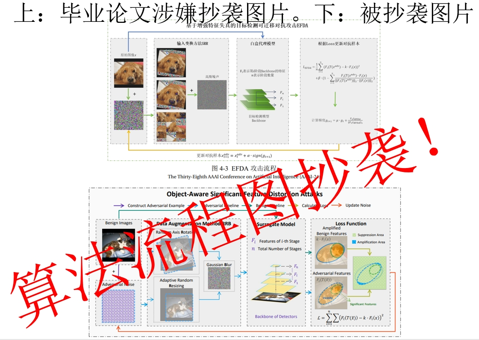 |
|:-------------------:|
|  毕业论文第4章涉嫌抄袭的算法框架图 |

其三，算法的主要创新点雷同。毕业论文第37页的4.3.1章节提到，本毕业论文所提EFDA算法主要包含两个创新点：损失函数的设计和数据增强的引入，而这两个创新点与论文[5]的主要创新点完全一致.

其四，数据增强（即输入变换）的设计雷同。毕业论文第43~44页提到，本毕业论文所提EFDA算法所用的输入变换操作包括随机网格打乱（Random block shuffle）、随机轴旋转（Random axis rotation）、自适应随机调整大小（Adaptive random resizing）、高斯模糊（Gaussian Blurring）与论文[5]所用输入变换Random axis rotation，Adaptive random resizing，Gaussian Blurring存在高度的重叠，只有一个随机网格打乱（Random block shuffle）是新加的。需要注意的是，将random block shuffle引入攻击算法以提升对抗样本的迁移性是一个很常见的做法，早已被其他人的公开发表论文研究过[6-7]，并不能算作本毕业论文的创新性工作。

其五，损失函数雷同。毕业论文第4章的核心损失函数——公式（4-9）与论文[5]所用核心损失函数雷同，唯一的不同之处是公式（4-9）额外加了一个余弦相似度项，如下图。需要注意的是，公式（4-9）的第一部分MSE损失和第二部分余弦相似度损失在原理上是等价的，所以一般只用其中一项即可。本毕业论文两项都用，明显是在故意洗稿，目的就是为了显得自己和[5]不同。

| 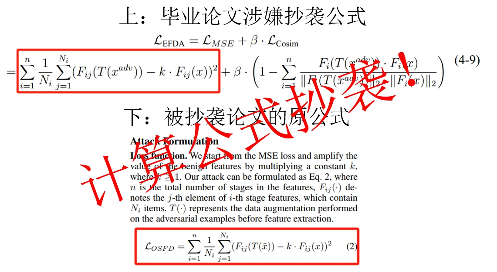 |
|:-------------------:|
|  毕业论文第4章涉嫌抄袭公式 |

[5] Ding X, Chen J, Yu H, et al. Transferable adversarial attacks for object detection using object-aware significant feature distortion[C]//Proceedings of the AAAI Conference on Artificial Intelligence. 2024, 38(2): 1546-1554.

[6] Wang K, He X, Wang W, et al. Boosting adversarial transferability by block shuffle and rotation[C]//Proceedings of the IEEE/CVF Conference on Computer Vision and Pattern Recognition. 2024: 24336-24346.
[7] Wang X, Zhang Z, Zhang J. Structure invariant transformation for better adversarial transferability[C]//Proceedings of the IEEE/CVF International Conference on Computer Vision. 2023: 4607-4619.

### 6. EFDA算法的绝大部分对比实验结果涉嫌数据抄袭或操纵

毕业论文第4章中表4-1, 4-2, 4-3, 4-4的实验数据大部分为直接拷贝自论文[1]的Table 1，少部分为编造。请参照对比图5，6，7，8. 其中不同的数据用黄色标记，相同的数据则无标记。可以发现：

| 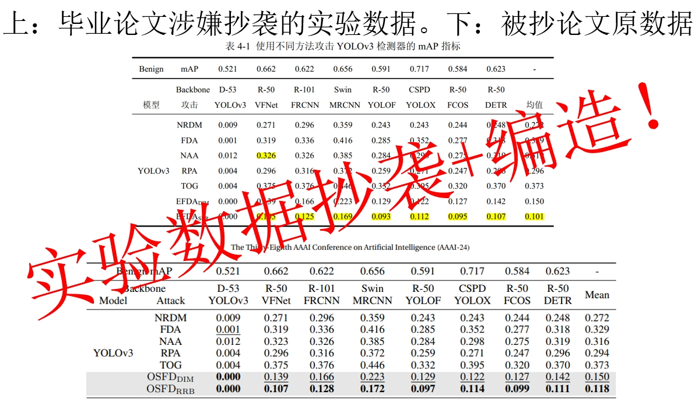 |
|:-------------------:|
|  毕业论文第4章涉嫌抄袭和编造的数据对比图1 |

| 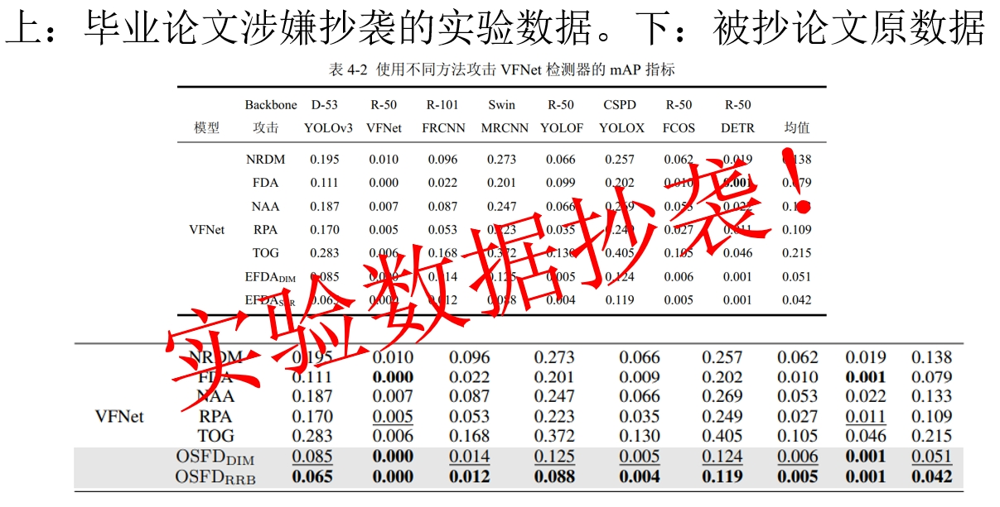 |
|:-------------------:|
|  毕业论文第4章涉嫌抄袭和编造的数据对比图2 |

| 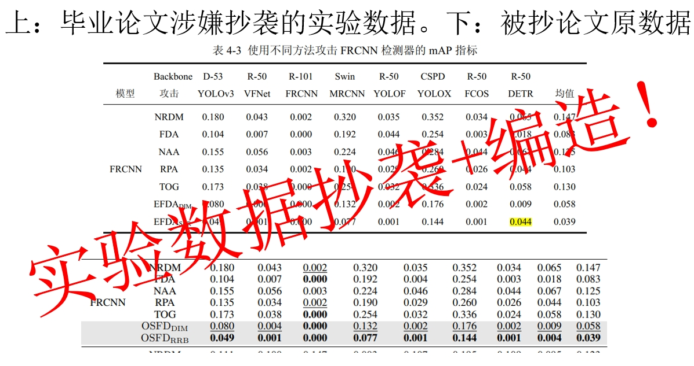 |
|:-------------------:|
|  毕业论文第4章涉嫌抄袭和编造的数据对比图3 |

| 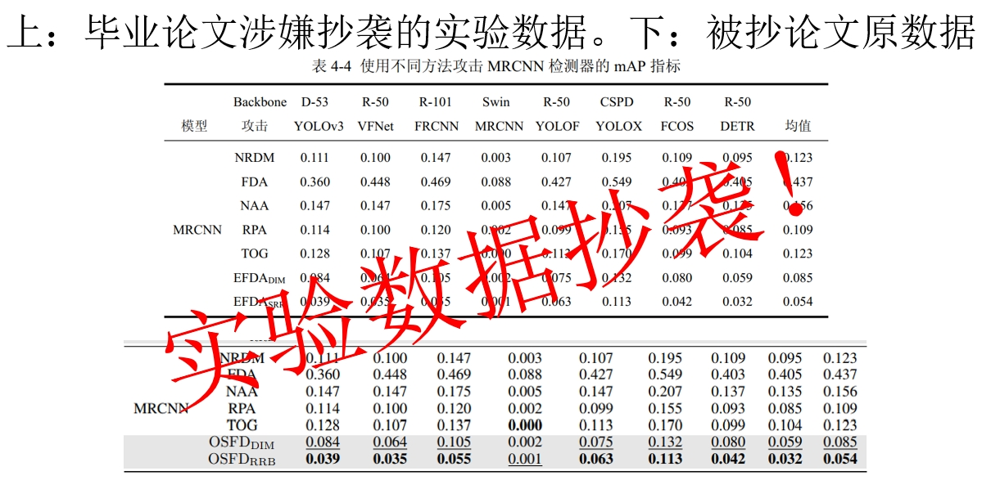 |
|:-------------------:|
|  毕业论文第4章涉嫌抄袭和编造的数据对比图4 |

其一，绝大部分的实验数据都完全一致，仅有图1，图3中少量数据不一致；

其二，不一致的数据很明显是我人为编造的。对于图1，最后一行的数据均不同，而倒数第二行的数据均相同，这是不可能的，因为按照毕业论文里的算法描述，EFDA_DIM和OSFD_DIM的损失函数是不同的，因此倒数第二行的数值不可能一模一样。我写作时大概率是误认为原论文[1]中只有最后一行是所提新方法的实验数据，因此只对最后一行做了扰动，而忘记对倒数第二行做扰动；

其三，均值计算错误，暴露了人为数据扰动的嫌疑。上述实验表格中，最后一列“均值”指的是前几列的平均数，然而我往往只改了前面的数字，而忘记修改均值，导致均值和前面的数字对不上。如图1的“NAA”一行、图3的EFDA_SRR一行。

### 7. EFDA算法的绝大部分消融实验结果涉嫌数据操纵

毕业论文的表4-5的实验数据有全部编造的嫌疑，如图9。

| 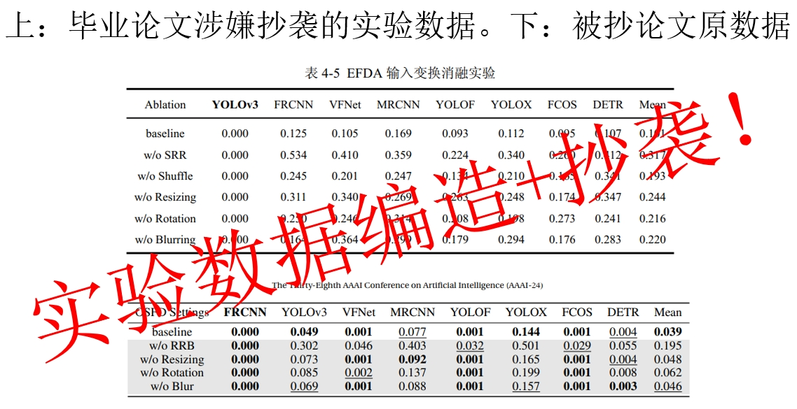 |
|:-------------------:|
|  第4章消融实验数据抄袭对比图 |

毕业论文第43~44页提到，本毕业论文所提EFDA算法所用的输入变换操作包括随机网格打乱（Random block shuffle）、随机轴旋转（Random axis rotation）、自适应随机调整大小（Adaptive random resizing）、高斯模糊（Gaussian Blurring），根本就没提到“Blurring”这一项，因此表4-5按理来说是不应该有”w/o Blurring”这一行的。估计是我抄的时候不仔细，忘了这一点；

其次，表4-5的实验设置不全，没有指出所用的代理模型是哪一个，非常可疑，代理模型是一个非常关键的实验设置，正常情况下不应该落下；

毕业论文第53页章节4.4.7第二段对实验结果的描述驴唇不对马嘴，且和表4-5不对应。文中描述说，
“为了评估 SRR 中每个组件对对抗攻击的个体贡献，通过移除其中一个组件同时保留其他三个来进行实验。实验结果表明，在迁移攻击能力评估中，网格打乱 > 旋转 >调整大小，黑盒迁移攻击能力依次降低。”
这句话的前半句提到，移除一个组件而保留其他三个组件，这说明一共应该有四个组件才对；然而这句话的后半句的不等式却只提到了三个组件（网格打乱、旋转、调整大小），数量前后对不上。
这句话的后半句提到了三种数据变换操作，少了”Blurring”，而这个”Blurring”在表格4-5里又有数据，这种不一致性非常可疑。

### 7. 第4章的大部分篇幅都在描述前人的算法、公式和原理，妄图将其混淆为本文的成果

毕业论文第4章的4.3.2全部内容为基于论文[8-10]的直接翻译，最多只能作为研究背景，而不应作为毕业论文的主要内容。这种做法涉嫌误导读者，让读者误认为[8-10]中的相关成果为本毕业论文的创新性成果。

毕业论文第4章的4.3.5绝大部分的文字内容都在介绍Grad-CAM的原理，和Fast-RCNN算法原理，这是很明显的水篇幅。Grad-CAM是计算机视觉领域一个非常著名的特征可视化算法，Fast-RCNN是目标检测领域一个非常经典的基础算法，这二者的相关知识最多只能作为背景介绍，而不应将其作为毕业论文的主要内容。

[8] Zhou W, Hou X, Chen Y, et al. Transferable adversarial perturbations[C]//Proceedings of the European Conference on Computer Vision (ECCV). 2018: 452-467.

[9] Naseer M, Khan S H, Rahman S, et al. Task-generalizable adversarial attack based on perceptual metric[J]. arXiv preprint arXiv:1811.09020, 2018.

[10] Ganeshan A, BS V, Babu R V. Fda: Feature disruptive attack[C]//Proceedings of the IEEE/CVF International Conference on Computer Vision. 2019: 8069-8079.

## 毕业论文第2章：抄袭多篇他人的综述性论文

### 8. 毕业论文“相关理论基础”2.3章节是大段抄袭自他人2023年发表于期刊ACM Computing Survey[11]上的综述性论文

2.3章节的两个小节2.3.1和2.3.2与原文[11]的组织结构完全一致；

2.3小节的全部文字性内容（一共3页）均为直接抄袭、翻译自论文[11]。如此大范围的段落雷同，即便添加了引用，也应当认定为抄袭。

| 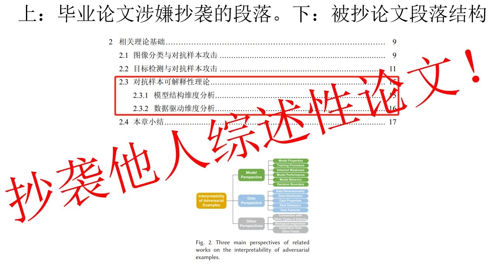 |
|:-------------------:|
|  第4章消融实验数据抄袭对比图 |

[11] Han S, Lin C, Shen C, et al. Interpreting adversarial examples in deep learning: A review[J]. ACM Computing Surveys, 2023, 55(14s): 1-38.

## 毕业论文对他人图片的抄袭

### 9. 大量图片为直接拷贝其他论文中的原图，且未在图片处添加任何图片来源或引用信息，侵犯了他人论文中图片的知识版权，如下图.

（1）毕业论文图3-2是直接拷贝论文[3]的Figure 1的右半部分

（2）毕业论文图3-3是直接拷贝论文[2]的Figure 1.

（3）毕业论文图4-1是直接拷贝论文论文[12]的Table 1

（4）毕业论文图4-2是直接拷贝论文[13]的Table 1

| 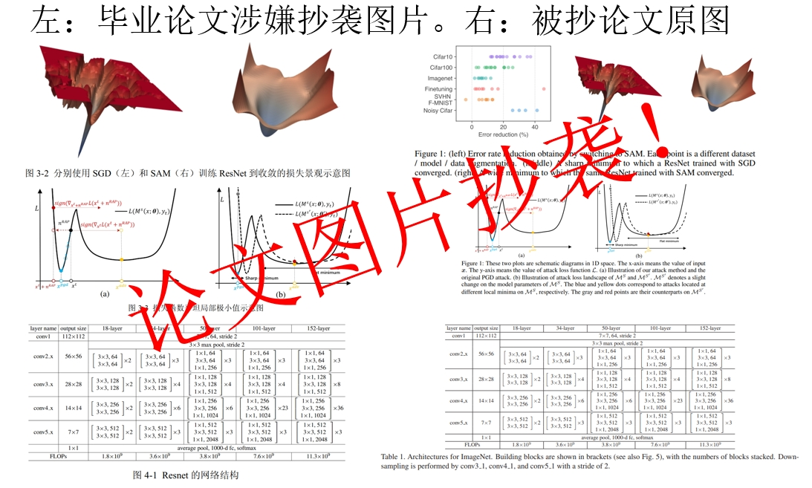 |
|:-------------------:|
|  毕业论文图片抄袭对比1 |

| 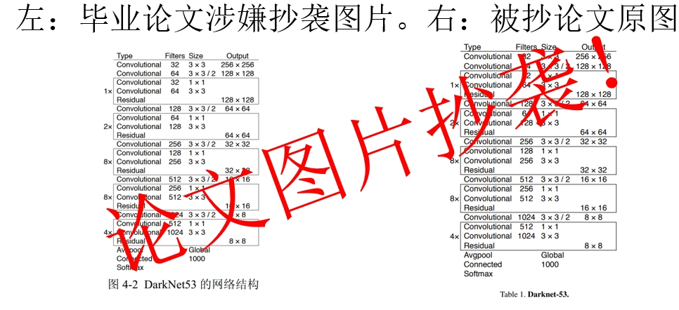 |
|:-------------------:|
|  毕业论文图片抄袭对比2 |

[12] He K, Zhang X, Ren S, et al. Deep residual learning for image recognition[C]//Proceedings of the IEEE conference on computer vision and pattern recognition. 2016: 770-778.

[13] Redmon J, Farhadi A. Yolov3: An incremental improvement[J]. arXiv preprint arXiv:1804.02767, 2018.

## 毕业论文的不规范引用

研究背景部分大量段落缺少参考文献标注。比如，毕业论文第1页章节1.1连一个参考文献都没有引用，非常不规范。第1页至少有20处需要添加参考文献。

毕业论文的参考文献格式严重不规范，将大量的会议论文[C]标记为[J]，将正式发表在学术会议的论文标记为“arXiv”论文，部分参考文献信息存在年份错误、页数缺失等问题。在陈美全毕业论文的97条参考文献中，不规范的参考文献多达37条，不规范比例高达38%。

## 毕业论文的源代码无法复现任何论文实验结果

### 10. 在我学术作假和学术不端行为被导师发现后，学院第一时间对我毕业论文所用服务器账号进行临时冻结，对我的毕业论文源代码进行审查，审查结果进一步佐证了我作假和抄袭的事实

- 我的服务器账号中仅有两篇被抄论文（即PGN和OSFD）的代码路径，完全没有我自己提出的新方法的路径，如下图；

| 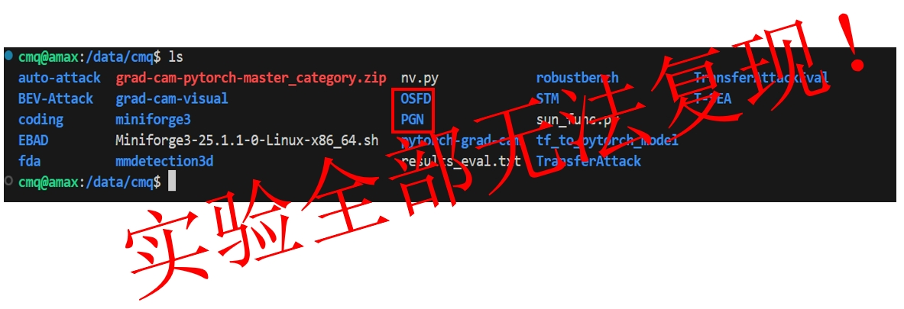 |
|:-------------------:|
|  毕业论文源代码无法复现论文中任何实验结果 |

- PGN核心代码全部原封不动没有修改，只添加了一些数据可视化的代码用于绘制论文插图，与毕业论文描述不一致；

| 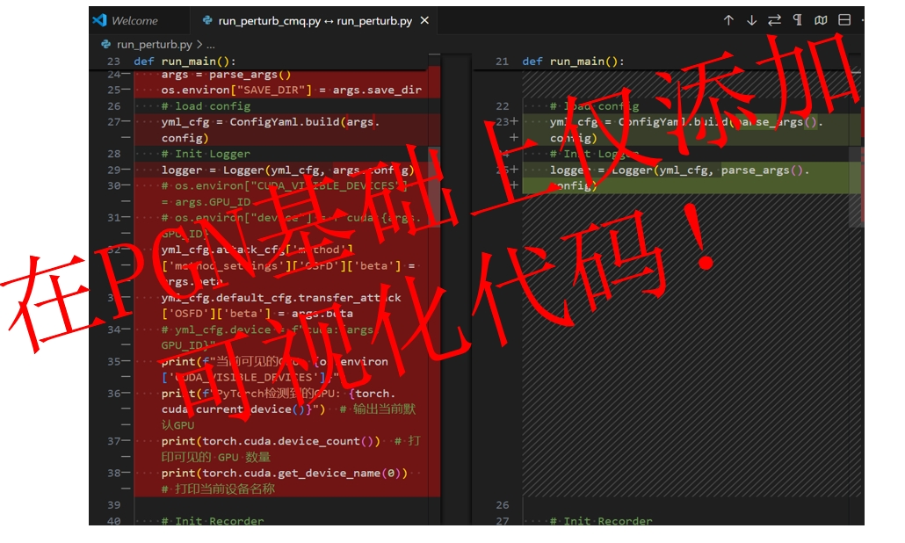 |
|:-------------------:|
|  毕业论文源代码仅在PGN基础上添加可视化功能 |

- 我的PGN源代码中所用的模型结构与毕业论文完全不一致。具体而言，毕业论文的实验结果中提到了Res-18, Vgg-16, Vgg-19, ViT模型，而代码中却完全没有这些模型

|  |
|:-------------------:|
|  毕业论文源代码无法复现论文中任何实验结果 |

- OSFD核心代码包括数据增强和损失函数两部分，其中数据增强部分完全未改动，与毕业论文描述不一致，损失函数部分虽然添加了余弦相似度项，但所有实验结果均与其原始实验记录不一致。

| 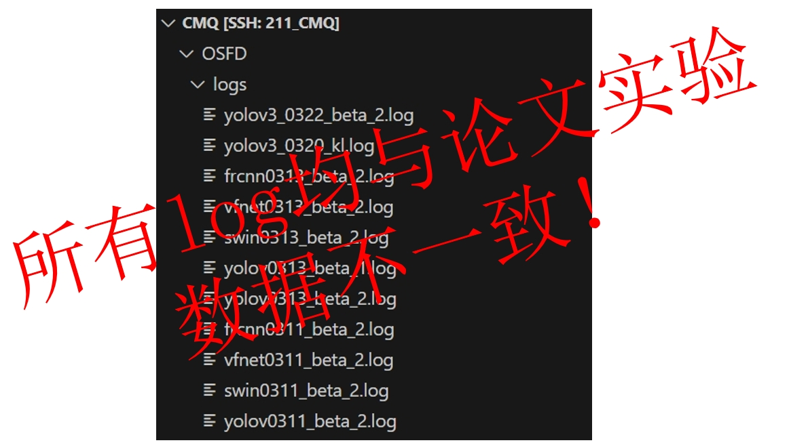 |
|:-------------------:|
|  毕业论文源代码原始实验记录（log）与论文实验结果均不一致 |

# 致谢与致敬

- 致敬：《中华人民共和国学位法》
- 致敬：《西安交通大学规范研究生学术行为实施办法》
- 致敬：所有敢于揭露学术不端行为的人，你们是真正的勇士